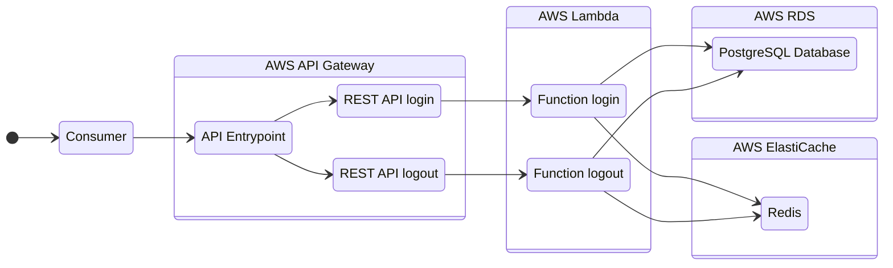

# NestJS Monorepo and Serveless Framework

This monorepo contains a set of **REST APIs microservices** built with **NestJS**, deployed using the **Serverless Framework** with **AWS Lambda** and **API Gateway** for serverless architecture. The project is managed with **Terraform** for infrastructure automation, integrating **AWS RDS** for relational database services and **AWS ElastiCache** for distributed caching. It is designed to streamline the deployment and management of serverless applications, offering seamless API integration, infrastructure provisioning, and efficient scaling on AWS.

## Technology Stack

- Serverless deployment: [Serverless Framework](https://www.serverless.com/), [Webpack](https://webpack.js.org/)
- Infrastructure as code (IaC): [Terraform](https://www.terraform.io/)
- AWS Cloud: [Lambda](https://aws.amazon.com/lambda/) functions and layers, [API Gateway](https://aws.amazon.com/api-gateway/), [RDS](https://aws.amazon.com/rds/), [ElastiCache](https://aws.amazon.com/elasticache/)
- Backend: [NestJS Framework](https://docs.nestjs.com/), Node.js, REST API, TypeScript
- Code organization: monorepo with [NestJS workspaces](https://docs.nestjs.com/cli/monorepo#monorepo-mode)
- Database and cache: PostgreSQL, Redis, [TypeORM](https://typeorm.io/)
- Security: [JWT](https://jwt.io/) and [BCrypt](https://www.npmjs.com/package/bcrypt)
- Tests: TO DO
- CI/CD: TO DO
- Documentation: [Mermaid (diagram-as-code)](https://mermaid.js.org/)
- Others: Docker

## General organization

The project has two endpoints, each one is an app inside the monorepo and run in its own lambda function:

- **Login**: receives username and password and issue an access token
- **Logout**: invalidates the token that made the logout

## DevOps flow

TO DO

## Documentation about

- [How to contribute](./CONTRIBUTING.md)
- [How to run from code](docs/markdown/how-to-run.md)
- [How to deploy](docs/markdown/how-to-deploy.md)
