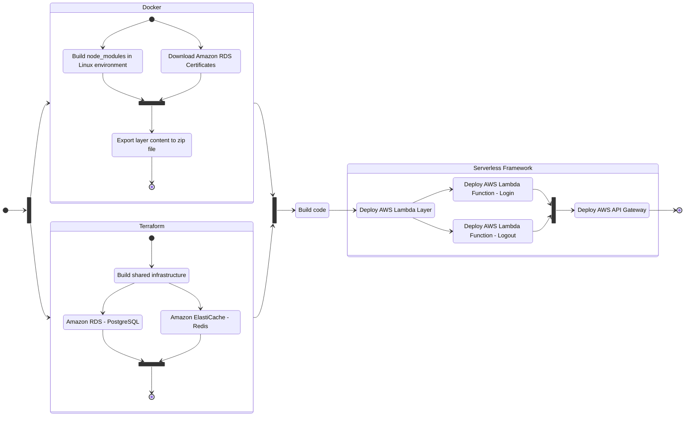
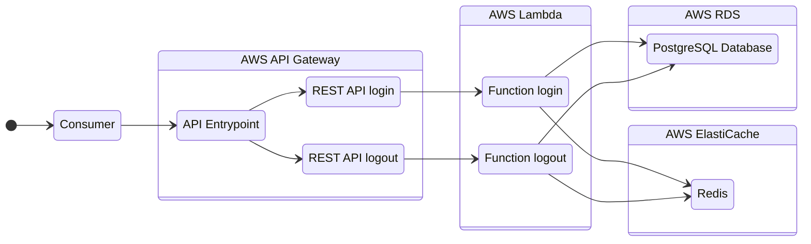

# NestJS and Serveless Framework

## Technology Stack

- **Monorepo**: This is a [monorepo](https://docs.nestjs.com/cli/monorepo#monorepo-mode) containing multiple Lambda functions and shared infrastructure
- **REST API**: The functions are built using REST APIs to enable communication between components
- **NestJS**: Uses [NestJS framework](https://docs.nestjs.com/) for building scalable server-side application
- **Cloud-Native Architecture**: Built using cloud-native patterns and best practices to maximize the benefits of the cloud infrastructure, such as scalability and high availability
- **Serverless Framework**: Deployed using the [Serverless Framework](https://www.serverless.com/) for easy management of serverless applications
- **AWS Lambda**: Used for serverless function execution, where business logic is run in response to events
- **AWS API Gateway**: Used to create and manage APIs, providing endpoints for client applications to interact with the functions
- **Infrastructure as Code (IaC)**: Manages shared infrastructure using [Terraform](https://www.terraform.io/)
- **AWS Cloud**: Uses [RDS](https://aws.amazon.com/rds/) (relational database services), and [ElastiCache](https://aws.amazon.com/elasticache/) (distributed caching)
- **Tests**: Unit and integration testing ([Jest](https://jestjs.io/))
- **Documentation**: [OpenAPI](https://swagger.io/specification/), [Mermaid (diagram-as-code)](https://mermaid.js.org/)
- **Others**: [TypeORM](https://typeorm.io/), [Webpack](https://webpack.js.org/), [JWT](https://jwt.io/)

## Deployment flow

See details as [how to deploy](docs/markdown/how-to-deploy.md) in the deployment documentation.

## General organization

The project has two endpoints for a simple [authentication flow](/docs/markdown/authentication-flow.md), each one is an app inside the monorepo and run in its own lambda function:

- **Login**: receives username and password and issue an access token
- **Logout**: invalidates the token that made the logout

## Documentation about

- [How to contribute](./CONTRIBUTING.md)
- [How to run from code](docs/markdown/how-to-run.md)
- [How to deploy](docs/markdown/how-to-deploy.md)
- [OpenAPI documentation](docs/markdown/documentation.md)
