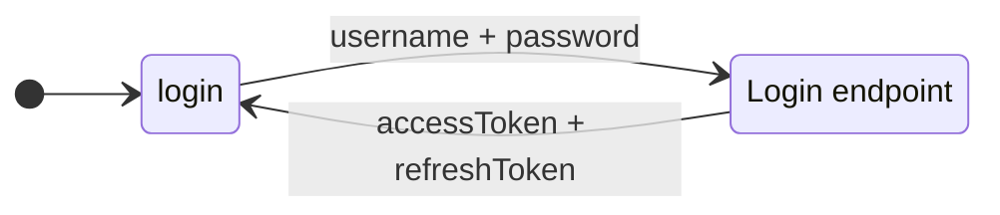
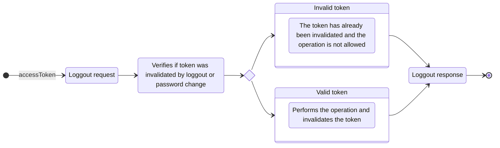

## How to authenticate, issue and invalidate tokens

## Login

The login process is simples:

1. An API call is made with username and password
2. If the user exists, is active and the password is correct, issues an `accessToken` and `refreshToken`
3. Each token have information about the `userId` and a `loginId` that represents this login request

## Logout

The logout process is:

1. The endpoint requires an `accessToken`
2. The `loginId` is extracted and added to the cache to mark that the token is now invalid

Once a login request is made, all access and refresh tokens has the same `loginId`. This way a logout process invalidates all access and refresh tokens issued without the need to store each token into database

